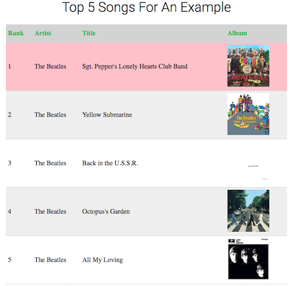

# Problem: Tables

In this exercise, you will practice writing HTML and CSS to create and style a _table_. For more information about tables, see [HTML table basics](https://developer.mozilla.org/en-US/docs/Learn/HTML/Tables/Basics) and [CSS Tables](https://www.w3schools.com/css/css_table.asp).

To complete the exercise, edit the included **`index.html`** and **`css/style.css`** files so that it includes a table detailing a "top 5" list of songs (either your favorites or for some other context):

(You can fill in the table's content with whatever songs you want).

Instructions for producing this table are detailed below. Note that you will need to edit both the CSS **and** the HTML.

1. In the HTML, add a _top-level heading_ that contains the text "Top 5 Songs For ____" (filling in the blank with whatever you want).

  - Add CSS rules so that the heading has a `font-weight` of 300, a `font-family` of `Roboto` (with a backup of sans-serif), and should have its [text aligned](https://developer.mozilla.org/en-US/docs/Web/CSS/text-align) in the center.

2. In the HTML, below the heading, add a `<table>` element to represent the table.

  - Add CSS rules so that the table takes up half of the page width. The table should also be centered on the page by giving it `margin-left` and `margin-right` values of `auto`.

3. Inside the `<table>` element, add an element to represent the [table header](https://developer.mozilla.org/en-US/docs/Web/HTML/Element/thead). The header should contain a single _table row_. That row should contain 4 [table heading cell](https://developer.mozilla.org/en-US/docs/Web/HTML/Element/th) elements (one per column): "Rank", "Artist", "Title", and "Album".

  - Add CSS rules to style the _table heading cell_ elements: they should have a height of `2rem`, have their text be aligned to the `left` (not centered), have a text color of `#1db954` (green) and a background color of `#d3d3d3` (a gray).

  - To get rid of the border between the cells of the header, specify the _table's_ `border-collapse` CSS property to be `collapse`.

4. Add an element representing the [table body](https://developer.mozilla.org/en-US/docs/Web/HTML/Element/tbody) to the `<table>`. The table body should contain 5 _table rows_. Each row should contain 4 [table data cell](https://developer.mozilla.org/en-US/docs/Web/HTML/Element/td) elements&mdash;one for each column. The first column (rank) should have the numbers 1 through 5. The remaining columns should have data about 5 different songs. 

  - The last column should contain images of the album covers. These images should be _links_ to where to hear the songs (a Spotify or Youtube link is fine). Give each link a [`target`](https://developer.mozilla.org/en-US/docs/Web/HTML/Element/a#attr-target) attribute so it opens in a new tab. Use CSS so that each album cover image is `100px` by `100px` in size.

5. All cells (the header cells AND the body cells!) should have `.5em` of [`padding`](https://developer.mozilla.org/en-US/docs/Web/CSS/padding) around their content. Each cell should also have a [`border-bottom`](https://developer.mozilla.org/en-US/docs/Web/CSS/border-bottom) that is `1px` thick, `solid`, and colored `#d3d3d3`.

6. Add CSS so that every other row in the table's _body_ (starting with the second row of content) has a background color of `#eee` (very light gray). Use the _pseudo-class_ [`:nth-child`](https://developer.mozilla.org/en-US/docs/Web/CSS/:nth-child) to select and color these rows. You can also use a _descendant selector_ to make sure that you're only styling rows in the table's body.

7. _Challenge_. Add a rule so that when you hover over a row (a `tr`) in the table's _body_, the background color of that row changes to `pink`. You'll need to use a _descendant selector_ and _pseudo-class_ (at the same time!) to make sure that the hover applies only to the rows in the _body_ and not to the header row!

Remember to check your work in the browser **before** you run Jest. Note that more information on HTML validation errors can be found in the in the [htmllint documentation](https://github.com/htmllint/htmllint/wiki/Options).